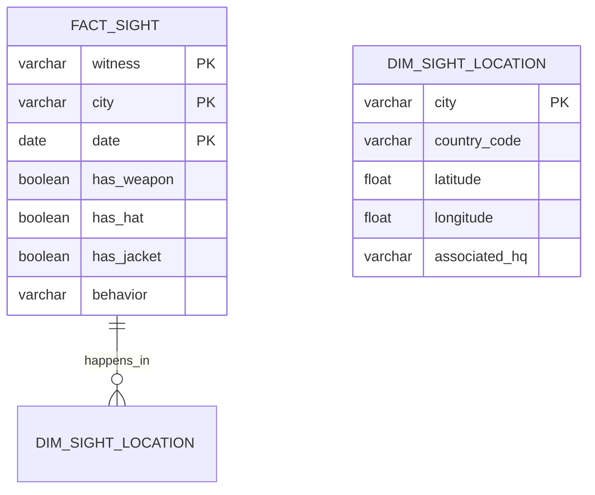
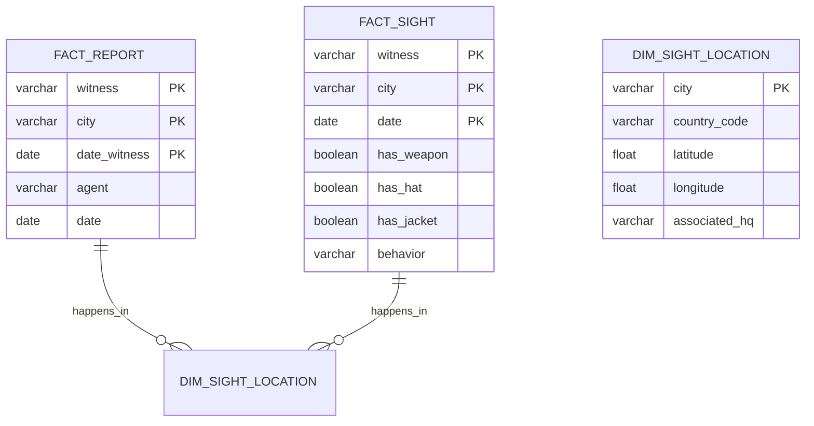

# Skill Assessment: dbt Data Engineer

Applicant: Gabriel Marques de Melo

[Project Description](README.pdf)

## Project Decisions:

### SQL flavor
A cloud instance of **PostgreSQL** was used as a warehouse option.

### ER diagram of persisted schema

Since the project is focused on the analytics output, I thought **dimensional modeling** (i.e., less normalized) could be applied to optimize reading, as long it has an NF>1 shape. Looking into the source data, I assumed a few things:
- `city`, `country`, `latitude`, and `longitude` are dependents, and the `city` is enough to be a key (i.e., there is no city that belongs to different countries, as there is no city with different lat/lon). All these columns were modeled to `DIM_SIGHT_LOCATION`;
- `associated_hq` (i.e., `city_agent`) has an N-to-1 relationship with the city, which means that each city belongs to a unique city_agent. Because of it, I decided to model this column also in `DIM_SIGHT_LOCATION`, instead of creating another table with this same information.
- In order to answer our analytical questions, I modeled the fact table `FACT_SIGHT` with the columns `witness`, `city`, and `date`, which are the natural keys, and `has_weapon`, `has_hat`, `has_jacket`, and `behavior` as measure columns.
- The reporter information (i.e., `agent` and `date_agent`) are not useful for our questions. Thus, I didn't include it in my modeling. If it was needed for any analysis (e.g., "Is there any relation between Mr. Sandiego behaving happy and the delay between a sight and a reporting being made?"), I will model it as a separate fact:



### Data Architecture


- Source data was ingested into dbt as `seeds`, exporting Excel file as .csv and changing delimiter to default comma (I make sure no source file has commas as the content of any column).
- A view layer was created above the seeds renaming the columns;

 I used macros to parse a query to convert it to the standard hardcoded output schema:
```python
 
    "{{source_column_name}}"::{{target_column_type}} AS {{ target_column_name }}



  
    target_schema:
      names: ["date_witness", "date_agent", "witness", "agent", "latitude", "longitude", "city", "country", "city_agent", "has_weapon", "has_hat", "has_jacket", "behavior"]
      types: ["date", "date", "varchar(255)", "varchar(255)", "float", "float", "varchar(255)", "varchar(255)", "varchar(255)", "boolean", "boolean", "boolean", "varchar(255)"]
  
  
  {{ return(conf_yml) }}


```

So the code for generating each one of the 8 source was pretty much identical, except by the local `source_table` variable definition:
```sql
. -- OR "AMERICA", etc.


-- If I needed to make any schema handling for a specify region, I could do here, changing target_schema

SELECT 

    {{ format_column(col.name, target_schema.types[loop.index0], target_schema.names[loop.index0]) }}
    
        ,
    

FROM
  {{ ref(source_table) }}
  ```

- An additional view was created unioning all views to make the load process for downstream tables easier;
- Final persisted tables were loaded in a different schema.

## Analytics

<center>a. For each month, which agency region is Carmen Sandiego most likely to be found?</center>

### Steps
- Join fact and dim to select `agency_region`
- Group sights by `agency_region` and month
- Rank the regions with more sights for each month
- Format the month as a string and show only the regions with the most occurrences each month.
<details>
  <summary>Code</summary>

```sql
WITH sight_with_location AS (
  SELECT *
  FROM {{ ref('fact_sight') }} fact
  INNER JOIN
    {{ ref('dim_sight_location') }} dim
    ON
        fact.city = dim.city
)
SELECT
    TO_CHAR(TO_DATE (month::text, 'MM'), 'Month') AS month_name,
    agency_region as agency_region_most_likely_to_find
FROM (
    SELECT 
        month,
        agency_region,
        RANK() OVER (PARTITION BY month ORDER BY qtt DESC) AS rank
    FROM (
        SELECT
            date_part('month', date) AS month,
            associated_hq as agency_region,
            COUNT(*) as qtt
        FROM
            sight_with_location
        GROUP BY
            date_part('month', date),
            associated_hq
    ) AS sights_by_month_and_agency_region
) AS ranked_agencies_with_sights_by_month
WHERE
    rank = 1
ORDER BY
    month
```
</details>

### Results

| month_name | agency_region_most_likely_to_find |
| ---------- | --------------------------------- |
| January    | Kolkata                           |
| February   | New York                          | 
| March      | New York                          |
| April      | New York                          |
| May        | Kolkata                           |
| June       | Kolkata                           |
| July       | New York                          |
| August     | Kolkata                           |
| September  | New York                          |
| October    | New York                          |
| November   | New York                          |
| December   | Kolkata                           |

---

<center>b. Also for each month, what is the probability that Ms. Sandiego is armed AND wearing a jacket, but NOT a hat? What general observations about Ms. Sandiego can you make from this?</center>

### Steps
- Select all sights, grouping them by month and counting
- Select sights with the appearance of weapon and jacket but not hat, grouping them by month and counting
- Join the above results and divide the counter of the latter by the former (i.e., to get the %)
- Format the month as a string
<details>
  <summary>Code</summary>
  
```sql
WITH all_sights_by_month AS (
    SELECT
        date_part('month', date) AS month,
        COUNT(*)
    FROM
        {{ ref('fact_sight') }}
    GROUP BY
        date_part('month', date)
),
sights_of_weapon_and_jacket_but_not_hat_by_month AS (
    SELECT
        date_part('month', date) AS month,
        COUNT(*)
    FROM
        {{ ref('fact_sight') }}
    WHERE
        has_weapon  AND
        has_jacket  AND
        NOT has_hat
    GROUP BY
        date_part('month', date)
)
SELECT
    TO_CHAR(TO_DATE (a.month::text, 'MM'), 'Month') AS month_name,
    CONCAT((b.count::decimal / a.count * 100)::text, '%') AS perc
FROM
    all_sights_by_month AS a
INNER JOIN
    sights_of_weapon_and_jacket_but_not_hat_by_month AS b
    ON
        a.month = b.month
ORDER BY
    a.month
```
</details>

### Results

| month_name | perc                    |
| ---------- | ----------------------- |
| January    | 3.83609415867480383600% |
| February   | 3.34928229665071770300% |
| March      | 4.62074978204010462100% |
| April      | 3.22003577817531305900% |
| May        | 3.48047538200339558600% |
| June       | 4.74100087796312554900% |
| July       | 3.83609415867480383600% |
| August     | 4.35919790758500435900% |
| September  | 4.32432432432432432400% |
| October    | 4.27201394943330427200% |
| November   | 2.43243243243243243200% |
| December   | 4.53356582388840453400% | 

> Carmen could be more likely to use a hat in November or use less a combination of weapon and jacket. On the other hand, Ms. Sandiego could be less likely to wear a hat in June, while also being armed and wearing a jacket.

---

<center>c. What are the three most occurring behaviors of Ms. Sandiego? </center>

### Steps
- Group all sights by `behavior`, ordering it by count
- Limit the results by 3 (i.e., only the top 3, with the biggest count value)
<details>
  <summary>Code</summary>
  
```sql
SELECT
    behavior as most_occuring_behaviors
FROM
    {{ ref('fact_sight') }}
GROUP BY
    behavior
ORDER BY COUNT(*) DESC
LIMIT 3
```
</details>

### Results

| most_occurring_behaviors |
| ------------------------ |
| out-of-control           |
| complaining              |
| happy                         |

---

<center>d. For each month, what is the probability Ms. Sandiego exhibits one of her three most occurring behaviors? </center>

### Steps
- Reuse the same query from the previous question to get the top 3 behaviors
- Select all sights, grouping them by month and counting
- Select sights with behaviors in top 3
- Join the above 2 results and divide the counter of the latter by the former (i.e., to get the %)
- Format the month as a string
<details>
  <summary>Code</summary>
  
```sql
WITH most_occuring_behaviors AS (
    SELECT
        behavior
    FROM
        {{ ref('fact_sight') }}
    GROUP BY
        behavior
    ORDER BY COUNT(*) DESC
    LIMIT 3
), most_occuring_behaviors_by_month AS (
    SELECT
        date_part('month', date) AS month,
        COUNT(*)
        FROM
            {{ ref('fact_sight') }}
        WHERE
            behavior IN (SELECT behavior FROM most_occuring_behaviors)
        GROUP BY
            date_part('month', date)
), all_sights_by_month AS (
    SELECT
        date_part('month', date) AS month,
        COUNT(*)
    FROM
        {{ ref('fact_sight') }}
    GROUP BY
        date_part('month', date)
)
SELECT
    TO_CHAR(TO_DATE (a.month::text, 'MM'), 'Month') AS month_name,
    CONCAT((b.count::decimal / a.count * 100)::text, '%') AS perc
FROM
    all_sights_by_month AS a
INNER JOIN
    most_occuring_behaviors_by_month AS b
    ON
        a.month = b.month
ORDER BY
    a.month
```
</details>

### Results

| month_name | perc                     |
| ---------- | ------------------------ |
| January    | 13.94943330427201394900% |
| February   | 13.77990430622009569400% |
| March      | 14.90845684394071490800% |
| April      | 13.77459749552772808600% |
| May        | 15.28013582342954159600% |
| June       | 13.78402107111501316900% |
| July       | 13.94943330427201394900% |
| August     | 13.77506538796861377500% |
| September  | 15.04504504504504504500% |
| October    | 12.11857018308631211900% |
| November   | 14.41441441441441441400% |
| December   | 13.77506538796861377500% | 
